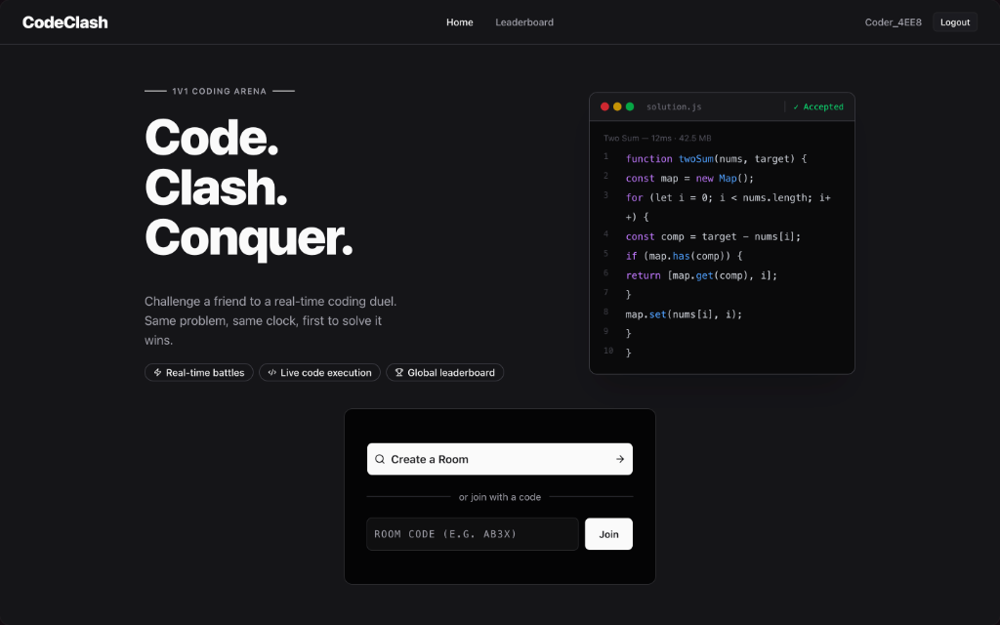

<div align="center">

# ⚔️ CodeClash

### Real-time 1v1 Competitive Coding Battles

**Race. Code. Win.**

[](https://code-clash0.vercel.app/)
[](https://github.com/vedantdadhich21/code-clash)
[](LICENSE)

</div>

---

## 🧩 What is CodeClash?

**CodeClash** is a real-time 1v1 competitive coding platform where two players race to solve the same DSA problem within a shared countdown timer. Think LeetCode — but multiplayer, live, and competitive.

- 🔴 **Live synchronization** — both players see the same timer, ticking down in real time
- ⚡ **Instant verdicts** — code is evaluated against hidden test cases via a sandboxed execution engine
- 🏆 **Ranked outcomes** — the first correct submission wins; results and stats are persisted

---

## 🎬 Demo



---

## ✨ Features

| Feature | Description |
|---|---|
| 🔐 **Google OAuth** | One-click sign-in via Firebase Authentication |
| 🏠 **Lobby System** | Create or join a battle room with a unique room ID |
| 🧑‍💻 **In-browser IDE** | CodeMirror-powered editor with syntax highlighting |
| 🌐 **Multi-language** | Supports Python, JavaScript, Java, C++ |
| ⏱️ **Synced Timer** | Shared countdown timer synced in real time for both players |
| 🤖 **Verdict Engine** | Evaluates against hidden test cases via Judge0 API |
| 📊 **Leaderboard** | Global rankings persisted in MongoDB |
| 👤 **Profile Page** | Match history, win/loss record, and stats per player |
| 🛡️ **Rate Limiting** | Helmet + express-rate-limit for API security |

---

## 🏗️ Architecture

```
┌─────────────────────────────────────────────────────────┐
│                      Frontend (React)                    │
│          Vite · React Router · Zustand · shadcn/ui       │
└───────────────────┬─────────────────────────────────────┘
                    │
        ┌───────────┴───────────┐
        │                       │
        ▼                       ▼
┌──────────────┐      ┌──────────────────────┐
│   Firebase   │      │  Express REST API    │
│  Realtime DB │      │  (Node.js + MongoDB) │
│  (live sync) │      │  (match history,     │
│  Firebase    │      │   leaderboard,       │
│  Auth        │      │   user profiles)     │
└──────────────┘      └──────────┬───────────┘
                                 │
                        ┌────────▼────────┐
                        │   Judge0 API    │
                        │ (sandboxed code │
                        │   execution)    │
                        └─────────────────┘
```

**Two separate real-time concerns, cleanly split:**
- **Firebase Realtime Database** → live battle state (timer sync, submission events, opponent status)
- **MongoDB via Express** → persistent data (match results, leaderboard, user stats)

---

## 🛠️ Tech Stack

**Frontend**
- [React 19](https://react.dev) + [Vite](https://vite.dev)
- [React Router v7](https://reactrouter.com)
- [Zustand](https://zustand-demo.pmnd.rs/) — global state management
- [TanStack Query](https://tanstack.com/query) — server state & caching
- [CodeMirror 6](https://codemirror.net/) — in-browser code editor
- [shadcn/ui](https://ui.shadcn.com/) + [Tailwind CSS v4](https://tailwindcss.com/)
- [Firebase SDK](https://firebase.google.com/) — Auth + Realtime Database

**Backend**
- [Node.js](https://nodejs.org) + [Express.js](https://expressjs.com)
- [MongoDB](https://www.mongodb.com/) + [Mongoose](https://mongoosejs.com/)
- [Firebase Admin SDK](https://firebase.google.com/docs/admin/setup) — JWT verification
- [Helmet](https://helmetjs.github.io/) + [express-rate-limit](https://express-rate-limit.mintlify.app/) — security

**Infrastructure**
- [Firebase Realtime Database](https://firebase.google.com/products/realtime-database) — live sync
- [Judge0 API](https://judge0.com/) — sandboxed code execution
- [Vercel](https://vercel.com) — frontend deployment
- [Firebase Auth](https://firebase.google.com/products/auth) — Google OAuth

---

## 📁 Project Structure

```
code-clash/
├── src/                        # React frontend
│   ├── pages/
│   │   ├── Home.jsx            # Landing + room creation
│   │   ├── Auth.jsx            # Google OAuth login
│   │   ├── Lobby.jsx           # Pre-battle waiting room
│   │   ├── Battle.jsx          # Live coding arena
│   │   ├── Results.jsx         # Post-match results
│   │   ├── LeaderBoard.jsx     # Global rankings
│   │   └── Profile.jsx         # User stats & history
│   ├── components/             # Shared UI components
│   ├── firebase/               # Firebase config & helpers
│   ├── store/                  # Zustand global state
│   ├── api/                    # Axios API client
│   └── hooks/                  # Custom React hooks
│
└── server/                     # Express backend
    └── src/
        ├── routes/
        │   ├── user.js         # User upsert & profile
        │   ├── matches.js      # Match CRUD + verdict
        │   ├── leaderboard.js  # Rankings endpoint
        │   └── determineWinner.js
        ├── models/
        │   ├── User.js         # Mongoose user schema
        │   └── Match.js        # Mongoose match schema
        ├── middleware/
        │   └── error.middleware.js
        └── config/
            └── db.js           # MongoDB connection
```

---

## 🚀 Getting Started

### Prerequisites

- Node.js 18+
- A [Firebase](https://console.firebase.google.com/) project with Realtime Database + Auth enabled
- A [Judge0](https://rapidapi.com/judge0-official/api/judge0-ce) API key (via RapidAPI)
- MongoDB connection string (local or [MongoDB Atlas](https://www.mongodb.com/cloud/atlas))

---

### 1. Clone the repo

```bash
git clone https://github.com/vedantdadhich21/code-clash.git
cd code-clash
```

### 2. Frontend setup

```bash
npm install
```

Create a `.env` file in the root:

```env
VITE_FIREBASE_API_KEY=your_key
VITE_FIREBASE_AUTH_DOMAIN=your_project.firebaseapp.com
VITE_FIREBASE_DATABASE_URL=https://your_project-default-rtdb.firebaseio.com
VITE_FIREBASE_PROJECT_ID=your_project_id
VITE_FIREBASE_APP_ID=your_app_id
VITE_JUDGE0_API_KEY=your_judge0_key
VITE_API_BASE_URL=http://localhost:3000
```

### 3. Backend setup

```bash
cd server
npm install
```

Create a `.env` file inside `server/`:

```env
PORT=3000
MONGO_URI=mongodb://localhost:27017/codeclash
CLIENT_URL=http://localhost:5173
```

Place your Firebase service account key at `server/serviceAccountKey.json`.

### 4. Run locally

```bash
# Terminal 1 — frontend
npm run dev

# Terminal 2 — backend
cd server && npm run dev
```

Open [http://localhost:5173](http://localhost:5173)

---

## 🔄 How a Battle Works

```
1. Player A creates a room  →  unique roomId generated (nanoid)
2. Player B joins with the roomId
3. Both land in the Lobby   →  ready-up screen
4. Battle starts            →  shared timer begins via Firebase Realtime DB
5. Both players code in their in-browser IDE (CodeMirror)
6. On submit  →  code sent to Judge0 API  →  evaluated against hidden test cases
7. First correct submission wins  →  Firebase notifies both clients instantly
8. Results page  →  winner determined, match saved to MongoDB
9. Leaderboard updated
```

---

## 🔐 Security

- All backend routes protected via **Firebase ID token verification** (JWT)
- API endpoints rate-limited (`20 req / 15 min` on auth routes)
- HTTP headers hardened with **Helmet**
- Request body size capped at `10kb`
- CORS restricted to whitelisted origins only

---

## 📄 License

MIT © [Vedant Dadhich](https://github.com/vedantdadhich21)

---

<div align="center">
  <sub>Built with ☕ and competitive frustration.</sub>
</div>
